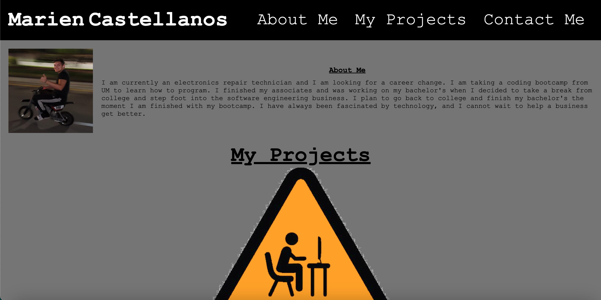

# <challenge2-portfolio>

## Description

Provide a short description explaining the what, why, and how of your project. Use the following questions as a guide:

- I wanted to create a portfolio so I can link my future projects and update the portfolio as I go to eventually have it be good enough to send out to any future employers. This is the foundation on my portfolio and I learned how to make a website from scratch. One that I would be proud to share considering when I starting coding. 

## Usage

This is a ScreenShot

## Credits

UM Coding Bootcamp
Stack Overflow
